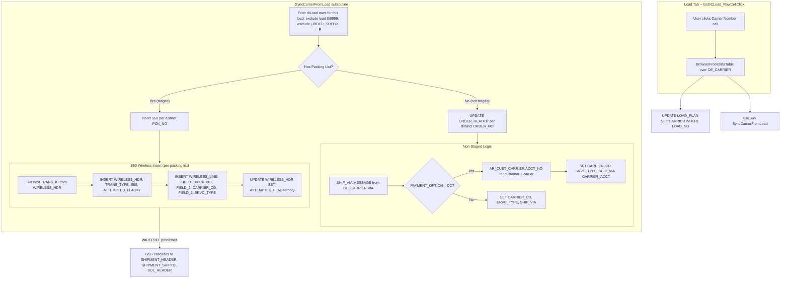

# Carrier Sync from Load Tab (Revised -- S50 Wireless Approach)

## Current State

The Load tab in [GAB_7546_OE_ShippingReview_Load.g2u](GAB_7546_OE_ShippingReview_Load.g2u) has three editable carrier fields that only update `LOAD_PLAN`:

- **Carrier Number** -> `LOAD_PLAN.CARRIER` (free-text, no validation against `OE_CARRIER`)
- **Carrier Load Number** -> `LOAD_PLAN.CARRIER_LOAD_NUM`
- **Carrier Trailer** -> `LOAD_PLAN.CARRIER_TRAILER`

None of these sync to ORDER_HEADER, SHIPMENT_HEADER, or BOL_HEADER. The order/shipment carrier (`CARRIER_CD` + `SRVC_TYPE`) is a normalized FK to `OE_CARRIER`, while `LOAD_PLAN.CARRIER` is a raw string.

## Target State

When the user selects a carrier from the Load tab:

1. An `OE_CARRIER` browser popup appears (same UX as Truck Type / Dock ID)
2. `LOAD_PLAN.CARRIER` is updated for all rows on the load
3. **Staged lines (have packing list)**: Insert an **S50 (Change Carrier)** wireless transaction per distinct packing list -> WIREPOLL processes it through GSS business logic, cascading carrier changes to SHIPMENT_HEADER, SHIPMENT_SHIPTO, BOL_HEADER, etc.
4. **Non-staged lines (no packing list)**: Directly `UPDATE ORDER_HEADER` with `CARRIER_CD`, `SRVC_TYPE`, `SHIP_VIA` (description from `SHIP_VIA.MESSAGE`), and `CARRIER_ACCT` (from `AR_CUST_CARRIER` if payment option is collect/CC)

## Why S50 Instead of Direct SQL

The previous plan proposed direct UPDATEs to 5 tables (ORDER_HEADER, ORDER_SHIP_TO, SHIPMENT_HEADER, SHIPMENT_SHIPTO, BOL_HEADER). The S50 approach is better because:

- GSS's WIREPOLL engine handles all cascading updates through the **same code path** as the GS Mobile Shipping Review carrier change (`Shipping-Review.aspx.vb`)
- Carrier changes may trigger product-side logic (freight recalculation, BOL SCAC propagation, validation, audit logging) that raw SQL bypasses
- Matches the existing pattern already in this script: `Click_Load_Ship` uses S40 wireless transactions (lines 7918-7935) to complete shipments through WIREPOLL rather than direct SQL
- Simpler implementation: 3 fields per S50 row vs. multi-table UPDATE statements

## S50 Field Map (from AGENTS.MOBILE.md section 14.14)

| WIRELESS_LINE Field | Value | Source |
|-|-|-|
| `Field_1` | Shipment ID (Packing List Number) | dtLoad `PACKING LIST` column |
| `Field_2` | Carrier Code | Browser selection `CARRIER_CD` |
| `Field_3` | Service Type | Browser selection `SRVC_TYPE` |
| `Field_4` - `Field_25` | Not Used | -- |

## Architecture



## Implementation Steps

### 1. Make Carrier Number a click-to-browse column

In `LoadOpenOrdersGV` (column setup ~line 2676), change the "Carrier Number" column:

```
AllowEdit=True, ReadOnly=False  -->  AllowEdit=False, ReadOnly=True
```

This matches Truck Type and Dock ID columns, which are read-only and open browsers on click.

### 2. Add RowCellClick case for Carrier Number

In `GsGCLoad_RowCellClick` (~line 4645), add a new `CaseAny("Carrier Number","CARRIER NUMBER")` block following the Truck Type pattern (lines 4884-4916):

1. Get `LOAD NUMBER` from the clicked row
2. Filter `dtLoad` for all rows on that load (exclude 0, 9999)
3. Query `OE_CARRIER` with payment option and via code: `SELECT RTRIM(CARRIER_CD) AS CARRIER_CD, SRVC_TYPE, RTRIM(SHORT_DESC) AS SHORT_DESC, RTRIM(LONG_DESC) AS LONG_DESC, RTRIM(PAYMENT_OPTION) AS PAYMENT_OPTION, RTRIM(VIA) AS VIA FROM V_OE_CARRIER ORDER BY CARRIER_CD, SRVC_TYPE`
4. Open `BrowserFromDataTable("Select a Carrier", "dtCarrier", "CARRIER_CD*!*SRVC_TYPE*!*SHORT_DESC*!*LONG_DESC*!*PAYMENT_OPTION*!*VIA", "100*!*80*!*200*!*300*!*100*!*60", v.Local.sRet)`
5. On selection (not `***CANCEL***`): parse result, update all dtLoad rows, update `LOAD_PLAN`
6. Call `SyncCarrierFromLoad` subroutine

### 3. Remove CellValueChanged case for Carrier Number

Remove the existing `CaseAny("Carrier Number","CARRIER NUMBER")` block in `GsGCLoad_CellValueChanged` (lines 3645-3674). The column is now read-only, so this code path is unreachable.

### 4. Create SyncCarrierFromLoad subroutine

New subroutine that receives carrier fields via globals (`V.Global.sCarrierCD`, `V.Global.iSrvcType`, `V.Global.sLoadNo`, `V.Global.sPaymentOption`, `V.Global.sVIA`):

**Step A -- Collect distinct packing lists (staged) and orders (non-staged):**

```
'-- Staged: distinct PACKING LIST values where PACKING LIST <> ''
Filter: [LOAD NUMBER] = {load} AND [LOAD NUMBER] <> 0 AND [LOAD NUMBER] <> 9999
        AND [ORDER_SUFFIX] <> 'P' AND [PACKING LIST] <> ''
-> ToDataTableDistinct on "PACKING LIST" -> dtStagedPL

'-- Non-staged: distinct ORDER_NO values where PACKING LIST = ''
Filter: [LOAD NUMBER] = {load} AND [LOAD NUMBER] <> 0 AND [LOAD NUMBER] <> 9999
        AND [ORDER_SUFFIX] <> 'P' AND [PACKING LIST] = ''
-> ToDataTableDistinct on "ORDER_NO" -> dtNonStagedOrders
```

**Step B -- S50 for each staged packing list** (following the S40 pattern from `Click_Load_Ship` lines 7918-7935):

```
For each distinct PCK_NO in dtStagedPL:
  1. Get next TRANS_ID:
     ExecuteAndReturn("SELECT TOP 1 RIGHT(CONCAT('000000000',CAST(TRANS_ID AS INT)+1),9)
                       FROM WIRELESS_HDR ORDER BY TRANS_ID DESC")
     LPad to 9 chars

  2. INSERT WIRELESS_HDR:
     (TRANS_ID, TRANS_TYPE='S50', ATTEMPTED_DATE='00000000', ATTEMPTED_TIME='00000000',
      USER_ID=v.Caller.user, BATCH=0, ATTEMPTED_FLAG='Y')

  3. INSERT WIRELESS_LINE:
     (TRANS_ID, SEQ='0000', TRANS_TYPE='S50',
      FIELD_1=PCK_NO, FIELD_2=CARRIER_CD, FIELD_3=SRVC_TYPE, ERROR_ID=0)

  4. Release for WIREPOLL:
     UPDATE WIRELESS_HDR SET ATTEMPTED_FLAG='' WHERE TRANS_ID='{transId}'
Next
```

**Step C -- Direct UPDATE for each non-staged order:**

```
'-- Resolve SHIP_VIA description from OE_CARRIER.VIA -> SHIP_VIA.MESSAGE
ExecuteAndReturn("SELECT RTRIM(MESSAGE) FROM SHIP_VIA WHERE ID = '{via}'", sShipViaDesc)

'-- If carrier payment is collect (CC), look up customer's carrier account
'   AR_CUST_CARRIER is keyed by SOFTWARE + CUST_NO + SHIPTO + CARRIER_CD + SRVC_TYPE
'   ACCT_NO (CHAR 30) holds the carrier account number
If V.Global.sPaymentOption = 'CC':
  For each distinct ORDER_NO + CUSTOMER combo in dtNonStagedOrders:
    ExecuteAndReturn("SELECT RTRIM(ACCT_NO) FROM AR_CUST_CARRIER
                      WHERE CUST_NO = '{custNo}' AND CARRIER_CD = '{cd}'
                      AND SRVC_TYPE = {type}", sCarrierAcct)
    UPDATE ORDER_HEADER SET CARRIER_CD = '{cd}', SRVC_TYPE = {type},
           SHIP_VIA = '{shipViaDesc}', CARRIER_ACCT = '{carrierAcct}'
    WHERE ORDER_NO = '{orderNo}'
  Next
Else:
  For each distinct ORDER_NO in dtNonStagedOrders:
    UPDATE ORDER_HEADER SET CARRIER_CD = '{cd}', SRVC_TYPE = {type},
           SHIP_VIA = '{shipViaDesc}'
    WHERE ORDER_NO = '{orderNo}'
  Next
EndIf
```

**Key lookups for Step C:**

| Lookup | Source Table | Key | Returns |
|-|-|-|-|
| Ship-via description | `SHIP_VIA` | `ID` = `OE_CARRIER.VIA` (CHAR 1) | `MESSAGE` (CHAR 50, e.g. "BEST WAY", "UPS") |
| Carrier account (collect only) | `AR_CUST_CARRIER` | `CUST_NO` + `CARRIER_CD` + `SRVC_TYPE` | `ACCT_NO` (CHAR 30) |
| Payment option | `OE_CARRIER` | Already in browser result | `PAYMENT_OPTION` (CHAR 2, "CC" = collect) |

### 5. Grid refresh for description columns

After the carrier change, refresh `CARR_SHORT_DESC` / `CARR_LONG_DESC` in dtLoad for the affected rows using the existing dictionaries (`dShortDesc`, `dLongDesc`) with the `CSRV` key (`CARRIER_CD + CAST(SRVC_TYPE AS CHAR(3))`).

### 6. User confirmation dialog

Before executing step 4, show a confirmation:
- Count of distinct staged packing lists that will get S50 transactions
- Count of distinct non-staged orders that will get direct ORDER_HEADER updates
- "Change carrier to {CARRIER_CD} / {SHORT_DESC} for X packing list(s) and Y order(s)?"

## Existing S40 Reference Pattern (lines 7918-7935)

The S50 implementation mirrors the existing S40 (Complete Shipment) pattern in `Click_Load_Ship`:

```7911:7935:GAB_7546_OE_ShippingReview_Load.g2u
f.Data.DataView.ToDataTableDistinct("dtload","dvloadship","dtloadShip","PACKING LIST",)
F.Data.Datatable.Select("dtLoadShip","[PACKING LIST] <> ''",v.Local.sSel)
...
    F.ODBC.Connection!Con.ExecuteAndReturn("select TOP 1 ...",V.Local.sTransIDNew)
    F.Intrinsic.String.LPad(V.Local.sTransIDNew,"0",9,V.Local.sTransIDNew)
    F.Intrinsic.String.Build("insert into WIRELESS_HDR ... values ('{0}','S40',...,'Y')",...)
    F.ODBC.Connection!Con.Execute(V.Local.sSQL)
    F.Intrinsic.String.Build("insert into WIRELESS_LINE ... values ('{0}','0000','S40','{1}',0)",...)
    F.ODBC.Connection!Con.Execute(V.Local.sSQL)
    F.Intrinsic.String.Build("update WIRELESS_HDR set ATTEMPTED_FLAG='' where TRANS_ID='{0}'",...)
    F.ODBC.Connection!Con.Execute(V.Local.sSQL)
```

The only difference for S50: `TRANS_TYPE='S50'` and `FIELD_2`/`FIELD_3` carry carrier code and service type.

## Safety Constraints

- **Outside PO lines**: Skip `ORDER_SUFFIX = 'P'` rows entirely (PO lines don't have sales order headers or GSS shipments)
- **WIREPOLL dependency**: S50 transactions require WIREPOLL to be running. If not running, rows queue up in WIRELESS_HDR/LINE and process when it starts.
- **No shipped-order guard needed for S50**: WIREPOLL/GSS business logic handles validation internally
- **Non-staged ORDER_HEADER update**: Sets `CARRIER_CD`, `SRVC_TYPE`, `SHIP_VIA` (description lookup), and conditionally `CARRIER_ACCT` (from `AR_CUST_CARRIER` when `PAYMENT_OPTION = 'CC'`). Does not touch SHIPMENT tables (no shipment exists yet)
- **AR_CUST_CARRIER miss**: If no matching `AR_CUST_CARRIER` row exists for the customer+carrier combo, leave `CARRIER_ACCT` unchanged on the order
- **Carrier Load Number / Carrier Trailer**: Remain as-is (free-text, LOAD_PLAN only)

## Files to Modify

- [GAB_7546_OE_ShippingReview_Load.g2u](GAB_7546_OE_ShippingReview_Load.g2u) -- the only file needing changes

## Bonus: Add ORDER_LINES.INFO_1 and INFO_2 to Grids

Add the `INFO_1` and `INFO_2` columns (CHAR 20 each, from `V_ORDER_LINES`) to the Open Orders, Due Today, and Load tabs as hidden columns available via Column Chooser.

### Changes required

**A. SQL queries -- add to SELECT clause:**

- **Open Orders** (`LoadOpenOrders`, ~line 1553): Add `RTRIM(A.INFO_1) AS INFO_1, RTRIM(A.INFO_2) AS INFO_2` to the StringBuilder query. `A` is the `V_ORDER_LINES` alias already used for `USER_1`-`USER_5`.

- **Load** (`LoadLoad`, ~line 1795): Same addition. Same `A` alias for `V_ORDER_LINES`.

- **Due Today** (`LoadDueOrders`): No SQL change needed -- it creates a DataView filter on `dtAllShip` (Open Orders data), so columns are inherited automatically.

**B. Grid column setup -- add to `LoadOpenOrdersGV`:**

Add column definitions near the other line-level fields (e.g., after USER_5). Both columns hidden by default:

```
'INFO_1
Gui.frmShip.[V.Args.GSGC].SetColumnProperty(V.Args.GV,"INFO_1","Caption","Info 1")
Gui.frmShip.[V.Args.GSGC].SetColumnProperty(V.Args.GV,"INFO_1","MinWidth","120")
Gui.frmShip.[V.Args.GSGC].SetColumnProperty(V.Args.GV,"INFO_1","AllowEdit",False)
Gui.frmShip.[V.Args.GSGC].SetColumnProperty(V.Args.GV,"INFO_1","ReadOnly",True)
Gui.frmShip.[V.Args.GSGC].SetColumnProperty(V.Args.GV,"INFO_1","Visible",False)

'INFO_2
Gui.frmShip.[V.Args.GSGC].SetColumnProperty(V.Args.GV,"INFO_2","Caption","Info 2")
Gui.frmShip.[V.Args.GSGC].SetColumnProperty(V.Args.GV,"INFO_2","MinWidth","120")
Gui.frmShip.[V.Args.GSGC].SetColumnProperty(V.Args.GV,"INFO_2","AllowEdit",False)
Gui.frmShip.[V.Args.GSGC].SetColumnProperty(V.Args.GV,"INFO_2","ReadOnly",True)
Gui.frmShip.[V.Args.GSGC].SetColumnProperty(V.Args.GV,"INFO_2","Visible",False)
```

Since `LoadOpenOrdersGV` is shared across Open Orders, Due Today, and Load tabs, all three get the columns automatically.

---

## Open Questions (to verify during implementation)

1. **WIRELESS_CARR_CHG table**: Schema shows `WIRELESS_CARR_CHG` (PCK_NO, CARRIER_CD, SRVC_TYPE) -- need to determine if S50 processing requires a row here, or if WIREPOLL reads only from WIRELESS_HDR/LINE. The S40 pattern does not insert into any auxiliary table, so S50 likely does not either.
2. **TRANS_ID collision handling**: The existing S40 pattern does a single `SELECT TOP 1 ... +1` without retry. Per AGENTS.MOBILE.md section 15, a retry loop for Zen duplicate-key Error 5 is recommended. Decide whether to match the existing S40 pattern or add the retry loop.
