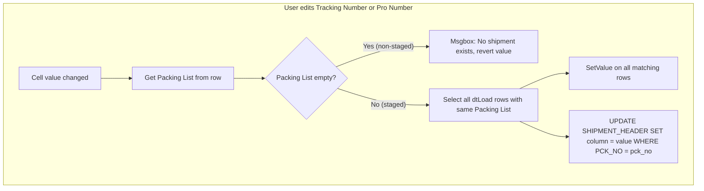

# Add Pro Number Column and Make Tracking/Pro Editable on Load Tab

## File to Modify

- [GAB_7546_OE_ShippingReview_Load.g2u](GAB_7546_OE_ShippingReview_Load.g2u) -- single file, all changes below

## Current State

- **Tracking Number** (`TRACKING_NO`) already exists on the Load tab grid as a **read-only** column, sourced from `V_SHIPMENT_HEADER.TRACKING_NO` via the packing list join chain
- **Pro Number** does **not** exist on the Load tab at all -- `V_SHIPMENT_HEADER.PRO_NO` (CHAR 20) is available but not selected in the query
- Editable column pattern is well-established: Carrier Load Number and Carrier Trailer use `CellValueChanged` to save to `LOAD_PLAN`

## Design Decisions

- **Save target:** `SHIPMENT_HEADER` only (base table behind `V_SHIPMENT_HEADER`)
- **Non-staged rows (no packing list):** Edits are blocked with a message -- no shipment exists to update
- **Propagation scope:** When one row is edited, all rows sharing the same packing list get the updated value in the grid, and `SHIPMENT_HEADER` is updated by `PCK_NO`

## Data Flow



## Implementation Steps

### 1. Add `PRO_NO` to the Load SQL query (~line 1813)

In `LoadLoad`, the SELECT clause already fetches `M.TRACKING_NO`. Add `M.PRO_NO` alongside it:

```
'-- Current:
", E.Address_1_Ship, ..., M.TRACKING_NO, RTRIM(M.WAY_BILL) AS WAY_BILL "

'-- Change to:
", E.Address_1_Ship, ..., M.TRACKING_NO, RTRIM(M.PRO_NO) AS PRO_NO, RTRIM(M.WAY_BILL) AS WAY_BILL "
```

### 2. Add `PRO_NO` to the Linq join column list (~line 1953)

The Linq join in `LoadLoad` explicitly lists all columns. Add `A.PRO_NO` after `A.TRACKING_NO`:

```
'-- Current:
...A.TRACKING_NO*!*A.WAY_BILL*!*A.Staged Qty...

'-- Change to:
...A.TRACKING_NO*!*A.PRO_NO*!*A.WAY_BILL*!*A.Staged Qty...
```

### 3. Make Tracking Number editable in `LoadOpenOrdersGV` (~lines 2623-2624)

Change from read-only to editable:

```
'-- Current:
Gui.frmShip.[V.Args.GSGC].SetColumnProperty(V.Args.GV,"TRACKING_NO","AllowEdit",False)
Gui.frmShip.[V.Args.GSGC].SetColumnProperty(V.Args.GV,"TRACKING_NO","ReadOnly",True)

'-- Change to:
Gui.frmShip.[V.Args.GSGC].SetColumnProperty(V.Args.GV,"TRACKING_NO","AllowEdit",True)
Gui.frmShip.[V.Args.GSGC].SetColumnProperty(V.Args.GV,"TRACKING_NO","ReadOnly",False)
```

### 4. Add Pro Number column definition in `LoadOpenOrdersGV` (~after line 2627)

Insert new column block after the TRACKING_NO block, before WAY_BILL:

```
'PRO_NO
Gui.frmShip.[V.Args.GSGC].SetColumnProperty(V.Args.GV,"PRO_NO","Caption","Pro Number")
Gui.frmShip.[V.Args.GSGC].SetColumnProperty(V.Args.GV,"PRO_NO","MinWidth","125")
Gui.frmShip.[V.Args.GSGC].SetColumnProperty(V.Args.GV,"PRO_NO","AllowEdit",True)
Gui.frmShip.[V.Args.GSGC].SetColumnProperty(V.Args.GV,"PRO_NO","ReadOnly",False)
Gui.frmShip.[V.Args.GSGC].SetColumnProperty(V.Args.GV,"PRO_NO","HeaderHAlignment","Center")
Gui.frmShip.[V.Args.GSGC].SetColumnProperty(V.Args.GV,"PRO_NO","CellHAlignment","Center")
Gui.frmShip.[V.Args.GSGC].SetColumnProperty(V.Args.GV,"PRO_NO","VisibleIndex","0")
```

### 5. Add PRO_NO to ResetGridColors (~after line 1296)

Add blue highlight styling for the new column alongside the existing TRACKING_NO highlight:

```
Gui.frmShip.GsGCLoad.SetColumnProperty("gvLoad","PRO_NO","CellBackColor",V.Enum.ThemeColors!ColorBlue.Highlight)
```

### 6. Add CellValueChanged handlers in `GsGCLoad_CellValueChanged`

Add two new `CaseAny` blocks following the Carrier Trailer pattern (~after line 3734). Both use the same logic structure:

**Tracking Number handler:**

```
CaseAny("Tracking Number","TRACKING_NO")
  1. Get "Packing List" from the edited row
  2. If packing list is empty:
     - Msgbox "Cannot edit tracking number -- no shipment exists for this line."
     - SetValue("dtLoad", rowIndex, "TRACKING_NO", "")
     - ExitSub
  3. Filter dtLoad: [Packing List] = '{pck_no}' AND [Packing List] <> ''
  4. Loop through matching rows, SetValue TRACKING_NO = V.Args.Value
  5. UPDATE SHIPMENT_HEADER SET TRACKING_NO = '{value}' WHERE PCK_NO = '{pck_no}'
```

**Pro Number handler:**

```
CaseAny("Pro Number","PRO_NO")
  1. Get "Packing List" from the edited row
  2. If packing list is empty:
     - Msgbox "Cannot edit pro number -- no shipment exists for this line."
     - SetValue("dtLoad", rowIndex, "PRO_NO", "")
     - ExitSub
  3. Filter dtLoad: [Packing List] = '{pck_no}' AND [Packing List] <> ''
  4. Loop through matching rows, SetValue PRO_NO = V.Args.Value
  5. UPDATE SHIPMENT_HEADER SET PRO_NO = '{value}' WHERE PCK_NO = '{pck_no}'
```

### 7. Verification

- Run `gab-lint` (exit 0)
- Run `Validate-GabApi.ps1` (exit 0)
- Sign via `gab-sign` skill
- Run `gab-test-debug` and confirm `SCRIPT COMPLETED SUCCESSFULLY` in trace

## Key Schema Reference

| Table | Column | Type | Size |
|-------|--------|------|------|
| SHIPMENT_HEADER | TRACKING_NO | CHAR | 30 |
| SHIPMENT_HEADER | PRO_NO | CHAR | 20 |
| V_SHIPMENT_HEADER | TRACKING_NO | CHAR | 30 |
| V_SHIPMENT_HEADER | PRO_NO | CHAR | 20 |

## Safety Notes

- `SHIPMENT_HEADER` is the base table; `V_SHIPMENT_HEADER` is the read view. UPDATEs go to the base table.
- Non-staged rows (empty packing list) are rejected with a message and the cell is cleared.
- `PSQLFriendly` should be applied to user-typed values before embedding in SQL to prevent injection and quote-escaping issues.
