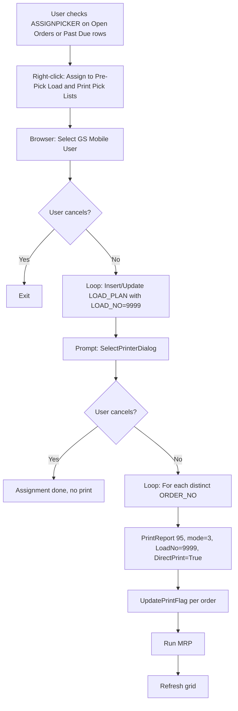

# TC-01: Pick List Printing by Line

## Existing Patterns to Leverage

The implementation reuses two well-established patterns in `GAB_7546_OE_ShippingReview_Load.g2u`:

- **Assign to 9999 pattern**: `Assign_Picker_9999` (line 6341) and `Assign_Picker_Due_9999` (line 6585) -- select a mobile user via browser, insert/update `LOAD_PLAN` with `LOAD_NO = 9999`, `PCKLST_DISP_FLAG = 1`
- **Report 95 print pattern**: `PrintPickList` (line 3398) calls `F.Global.BI.PrintReport(95, mode, ["OrderNo","LoadNo"], [orderNo, loadNo])` -- this is the existing Shipping Dashboard Pick List report, and `ShippingDashPicklist_Load.rpt` IS Report 95

## Changes Required

### 1. Context Menu Registration (in `SetContextMenus`, lines ~858-867)

Add two new menu items (one per tab), gated on `bUseGSMobilePicklist` AND `bUseLoadPlanning`:

- **Past Due tab** (`CTXDUE`): `AssignPicker_Due_9999_Print` -> `"Assign to Pre-Pick Load & Print Pick Lists"` -> handler `Assign_Picker_Due_9999_Print`
- **Open Orders tab** (`CTXOPEN`): `AssignPicker_9999_Print` -> `"Assign to Pre-Pick Load & Print Pick Lists"` -> handler `Assign_Picker_9999_Print`

Place them immediately after the existing `AssignPicker_Due_9999` / `AssignPicker_9999` items.

### 2. Two New Subroutines

Each mirrors its existing `Assign_Picker_*_9999` counterpart but adds a print step after the assignment loop.

**`Assign_Picker_9999_Print`** (Open Orders / `dtAllShip`):
1. Clone the logic of `Assign_Picker_9999` (lines 6341-6461):
   - Filter `dtAllShip` where `ASSIGNPICKER = 1`
   - Browser for mobile user
   - Loop: insert/update `LOAD_PLAN` with `LOAD_NO = 9999`
2. After assignment completes, prompt printer: `F.Intrinsic.Printer.SelectPrinterDialog`
3. Build a distinct list of ORDER_NOs from the assigned rows
4. For each distinct ORDER_NO, call:

```
F.Global.BI.PrintReport(95, 3, ["OrderNo","LoadNo"], [orderNo, "9999"], printer, True)
```

5. Call `UpdatePrintFlag` per order (like the existing PICKLIST cell-click handler at line 3268)
6. Run MRP (`run_MRP`) as the existing 9999 assign does

**`Assign_Picker_Due_9999_Print`** (Past Due / `dtDueShip`):
- Same logic but operates on `dtDueShip` instead of `dtAllShip`

### 3. Printer Handling

Use a local variable (`V.Local.sPrinter`) within each sub -- no global needed since the print happens in the same sub as the assignment. Pattern matches `Click_Print_PL_Certs` (line 8045):

```
F.Intrinsic.Printer.SelectPrinterDialog
F.Intrinsic.Control.If(v.Ambient.PRINTERDIALOGSELECTION, <>, "***CANCEL***")
    V.Local.sPrinter.Set(v.Ambient.PRINTERDIALOGSELECTION)
    ... print loop ...
F.Intrinsic.Control.EndIf
```

### 4. Report Call Details

- **Report ID**: 95 (existing BI-registered report, `ShippingDashPicklist_Load.rpt`)
- **Mode**: 3 (direct print)
- **Parameters**: `OrderNo` + `LoadNo` (same as existing PrintPickList at line 3430)
- **LoadNo value**: `"9999"` (the pre-pick load)
- **Printer**: from `SelectPrinterDialog`
- **Direct print**: `True`
- **Page breaks**: handled internally by the Crystal Report (per-line grouping)

### 5. No Crystal Report Changes

The report handles per-line page breaks internally. No programmatic `.rpt` modification needed.

## Flow Diagram


